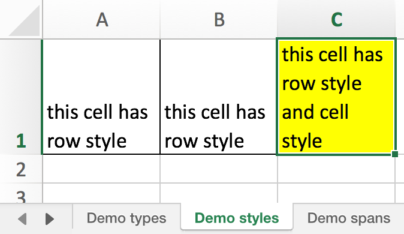
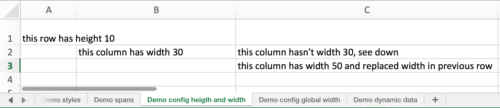
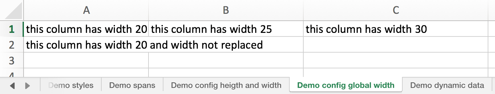
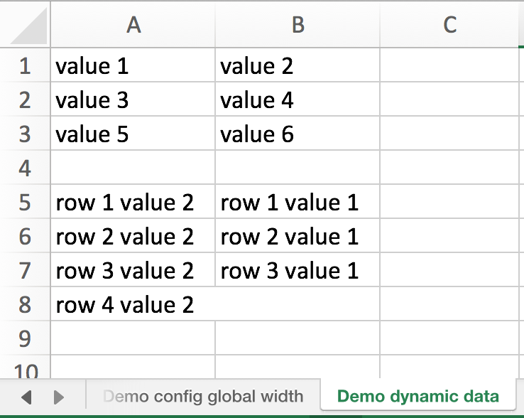

# Excel Builder

## TODO Features

### Configure builder

```groovy

```

### Build excel use closures

#### Example code

```groovy
builder.build {
    sheet(name: "Demo types") {
        row {
            cell {
                "string value"
            }
            cell {
                // integer value
                1
            }
            cell {
                // date value
                new Date()
            }
            cell {
                "dyna" + "mic"
            }
        }
    }
    sheet(name: "Demo styles") {
        row(style: rowStyle) {
            cell {
                "this cell has row style"
            }
            cell {
                "this cell has row style"
            }
            cell(style: cellStyle) {
                "this cell has row style and cell style"
            }
        }
    }
    sheet(name: "Demo spans") {
        row {
            cell(colspan: 2) {
                "cell has width 2 columns"
            }
            cell(rowspan: 2, style: wrap, width: 12) {
                "cell has height 2 rows"
            }
            cell(colspan: 2, rowspan: 2, style: wrap) {
                "cell has heigth 2 rows and width 2 columns"
            }
        }
        // this row not necessary, this row show only dummy-row
        row { /* dummy */ }
    }
    sheet(name: "Demo config height and width") {
        row(height: 10) {
            cell {
                "this row has height 30"
            }
        }
        row {
            cell { /* dummy */ }
            cell(width: 30) {
                "this column has width 30"
            }
            cell(width: 30) {
                "this column hasn't width 30, see down"
            }
        }
        row {
            cell { /* dummy */ }
            cell { /* dummy */ }
            cell(width: 50) {
                // Какую политику использовать или какой вариант более явный и очевидный:
                //  - устанавливать новую ширину
                //  - оставлять прежнюю ширину и выводить предупредение в лог
                //  - использовать для ширины максимальное значение
                // ?
                // П.С. Например, если установить на уровне листа ширину, то установка 
                //  ширины на уровне колонки будет запрещена или проигнорирована (см. ниже)
                "this column has width 50 and replaced width in previous row"
            }
        }
    }
    sheet(name: "Demo config global width", widthColumns: [20, 25, 30]) {
        row {
            cell {
                "this column has width 20"
            }
            cell {
                "this column has width 25"
            }
            cell {
                "this column has width 30"
            }
        }
        row {
            cell(width: 100) {
                "this column has width 20 and width not replaced"
            }
        }
    }
    sheet(name: "Demo dynamic data", widthColumns: [12, 12) {
        def data1 = [
            ["value 1", "value 2"],
            ["value 3", "value 4"],
            ["value 5", "value 6"]
        ]
        
        for (def rowData : data1) {
            row {
                for (def cellData : rowData) {
                    cell {
                        cellData
                    }
                }
            }
        }
        
        row { /* dummy */ }
        
        def data2 = [
            [prop1: "row 1 value 1", prop2: "row 1 value 2"],
            [prop1: "row 2 value 1", prop2: "row 2 value 2"],
            [prop1: "row 3 value 1", prop2: "row 3 value 2"],
            [prop1: null, prop2: "row 4 value 2"]
        ]
        
        for (def rowData : data2) {
            row {
                cell(colspan: rowData.prop ? 1 : 2) {
                    rowData.prop2
                }
                if (rowData.prop) {
                    cell {
                        rowData.prop1
                    }
                }
            }
        }
    }
}
```

#### Example results






